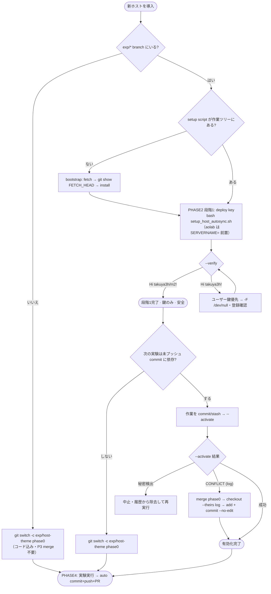

# 他サーバー auto-sync 導入ランブック（ケース別フロー）

andrew (2026-07-13) で実証した「deploy key 設定 → 有効化 → 実験」の手順を、
**どのケースでどの分岐を取るか**で整理したもの。Bengio / lecun / philip / ilya にそのまま再現できる。

- trunk: `phase0` ／ push: **deploy key（`exp/*` 限定）** ／ 停止: `EGOSURGERY_AUTOSYNC=0`
- 設計/実装は [`docs/superpowers/specs/2026-07-10-experiment-git-autosync-design.md`](superpowers/specs/2026-07-10-experiment-git-autosync-design.md)、
  スクリプトは [`scripts/sync/setup_host_autosync.sh`](../scripts/sync/setup_host_autosync.sh)、運用は `slocal/sync/README.md §5.5`。

## ケース別ルーター

| ケース | 状況 | 経路 |
|---|---|---|
| **A** | まだ実験しない・鍵だけ先行配備したい | P1 → P2 で停止（段階1） |
| **B** | 現 branch の未プッシュ commit を保って実験 | P1 → P2 → P3(現branch) → P4 |
| **C** | 現作業に依存しない新規・独立の実験 | P1 → P2 → 新branch → P4 |

## フローチャート



## PHASE 0 — 前提を確認

作業 branch が `exp/*` であることが auto-sync の前提（guard #2）。

- **`exp/<host>-*` にいる** → PHASE 1 へ。
- **いない** → phase0 から作る（この branch は phase0 由来＝**コード込み**なので PHASE 3 の merge 不要）:
  ```bash
  git switch -c exp/<host>-<theme> phase0
  ```

## PHASE 1 — セットアップスクリプトを取得

keeper は phase0 の *ref* だけ進め作業ツリーは触らないため、各ホストで取り出す。

- **既にある** → PHASE 2 へ。
- **無い** → phase0 から当該ファイルだけ取り出す:
  ```bash
  git fetch origin phase0
  git show FETCH_HEAD:scripts/sync/setup_host_autosync.sh > /tmp/setup.sh
  grep -c -- '--activate' /tmp/setup.sh   # >=1 で v2
  mkdir -p scripts/sync
  install -m 755 /tmp/setup.sh scripts/sync/setup_host_autosync.sh
  ```
  > ⚠ `origin/phase0:path` は使わない（各ホストに `origin/phase0` の ref が無く `ambiguous argument`）。**`FETCH_HEAD`**（または local `phase0`）を使う。
  > 直接 `>` リダイレクトも不可（git 失敗時に**空ファイル**が残る）→ **temp に出して `install`**。

## PHASE 2（段階1）— deploy key を設定【安全】

push も merge も working-tree 変更も起きない。**未プッシュ・未マージの作業は無傷**。

```bash
bash scripts/sync/setup_host_autosync.sh
# ★ ilya / philip は hostname=aolab 衝突のため名前を明示:
#   SERVERNAME=philip bash scripts/sync/setup_host_autosync.sh
```

- **gh 認証がホストにある** → `deploy-<host>` を自動登録（write）。
- **無い** → 表示された公開鍵を gh 認証済みホスト（efros）で登録:
  ```bash
  gh api repos/takuya3h/m2/keys -X POST -f title=deploy-<host> -f key='<公開鍵>' -F read_only=false
  ```

疎通確認:
```bash
bash scripts/sync/setup_host_autosync.sh --verify
```
| 出力 | 意味 | 対処 |
|---|---|---|
| `Hi takuya3h/m2!` | scoped な deploy key 経路 | **段階1完了** ✓ |
| `Hi takuya3h!` | ユーザー鍵が優先 | `core.sshCommand` の `-F /dev/null` と登録を確認 |
| NG | 未登録の可能性 | 数秒待って再試行 / 公開鍵を再登録 |

→ ここで止めれば **auto-sync 未発火**（未プッシュ作業は安全）。全ホストに先行配備してよい（ケース A）。

## PHASE 3（段階2）— 有効化【実験を回すとき】

- **次の実験が現 branch の未プッシュ commit に依存しない（ケース C）** → クリーンに作り直す:
  ```bash
  git switch -c exp/<host>-<theme> phase0   # 衝突なし → PHASE 4
  ```
- **依存する（ケース B）** → 現 branch で有効化:
  1. 作業を commit / stash してツリーをクリーンに。
     > ⚠ `.claude/hooks/auto_notion_sync.log` が再 dirty 化する（フックが追記）。破棄: `git checkout -- .claude/hooks/auto_notion_sync.log`
  2. 有効化:
     ```bash
     bash scripts/sync/setup_host_autosync.sh --activate
     ```

`--activate` の結果別:
| 結果 | 対処 |
|---|---|
| 秘密を検出 | **中止**。未プッシュ履歴から token 等を除去して再実行 |
| 未コミット変更あり | merge skip。ツリーをクリーンにして再実行 |
| `CONFLICT (add/add): auto_notion_sync.log` | 手動解決（下記） |
| 成功 | 完了。`ls src/egosurgery/utils/git_autosync.py` / `HEAD` が Merge commit |

ログ衝突の手動解決:
```bash
git merge phase0
git checkout --theirs .claude/hooks/auto_notion_sync.log
git add .claude/hooks/auto_notion_sync.log
git commit --no-edit
```

## PHASE 4 — 実験を実行 → 自動同期

通常どおり学習を回すだけ。完走時に `finalize` が証跡を自動 commit + push し、CI が phase0 宛ドラフト PR を起票する。

- 試し実行（同期させない）: 先頭に `EGOSURGERY_AUTOSYNC=0`
  ```bash
  EGOSURGERY_AUTOSYNC=0 python -m egosurgery.train stage=...
  ```
- ⚠ **初回の自動 push で branch 全体が public origin に載る**（未プッシュ commit も含む）。秘密は PHASE 3 の `--activate` ゲートで事前確認済みであること。

## 落とし穴クイックリファレンス

| 症状 | 原因 | 対処 |
|---|---|---|
| `fatal: ambiguous argument 'origin/phase0:…'` | ホストに `origin/phase0` ref が無い | `git show FETCH_HEAD:…`（or `phase0:…`） |
| 取得スクリプトが空ファイル | `>` が git 失敗前にファイル作成 | `/tmp` へ出して `install` |
| `ERROR: hostname=aolab は衝突` | ilya/philip が同一 hostname | `SERVERNAME=<host>` を前置 |
| `--verify` が `Hi takuya3h!` | ユーザー鍵が優先 | `-F /dev/null`＋登録を確認 |
| `CONFLICT (add/add): auto_notion_sync.log` | 追跡ログを各ホストが個別追記 | `--theirs` で解決。**恒久策**: phase0 で `git rm --cached` + `.gitignore` |
| activate で毎回「未コミット変更あり」 | 追跡ログが再 dirty 化 | `git checkout -- .claude/hooks/auto_notion_sync.log` 後に再実行 |

## 発火条件（要件）

① `exp/*` branch 上 ② `git_autosync`/`finalize` コードが作業ツリーに在る（PHASE 3） ③ deploy key 構成済（PHASE 2） ④ 実験完了で差分あり。
いずれか欠けると **graceful skip**（壊れない・実験は止まらない）。
