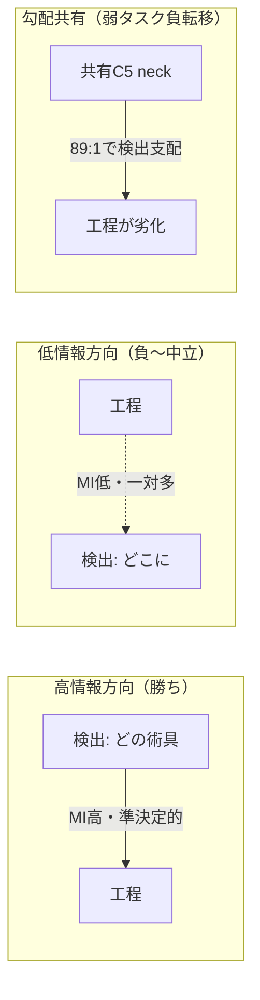
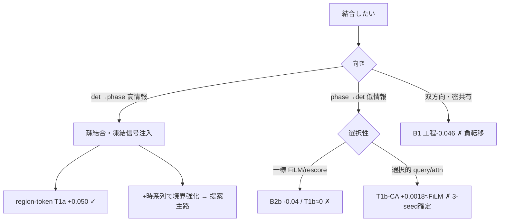

# STEP C 分析 — 検出×工程 タスク結合の機構解明・実証・最良結合法の設計（v2）

> **本版(v2)の進化点**: STEP B の集計に加え、**per-phase / per-class への分解で「どこで・なぜ効くか」を実データで実証**した。
> det→phase の利得は EDA が予言した**混同工程 hemostasis（F1 +0.36〜+0.45）に集中**し、機構が確定。
> 一方 phase→det(FiLM) は EDA が示唆した rare∧工程特異術具を**救わない**ことも判明し、提案(§7)を「証拠で」精緻化した。

- 対象: STEP B 結合実験（B2a / T1a / B1固定 / B1 K&G / B2b / T1b-FiLM）の**実測**＋両EDA（`dataset_eda`・`annotations_eda`）。
- 厳守: 数値は全て `experiments/` 証跡から実測（捏造ゼロ）。改善判定は §10.1 の **paired-σ（対seed差・|平均|>paired-σ かつ同符号）**。
- **T1b-CA（cross-attention phase→det, §4.6 primary）は seed42/123/456 完走**（2026-06-23, lecun 2GPU 並列）。§3.6 に **3-seed 確定**（Δ_det +0.00178±0.0005, paired-σ |mean|/σ=3.58・同符号）として収録。**CA は FiLM を上回らず**＝phase→det は機構非依存で弱い、が確定。

---

## 0. エグゼクティブサマリ

### 0.1 三つの確定事実（STEP B + 実証分解）
1. **結合は「向き」で符号が決まる（強い非対称）。** det→phase は大勝ち（phase acc +3.8〜+5.0pt / 公式 macro-F1 +8.2〜+9.6pt, 有意）。phase→det は中立〜負（再スコア −0.04 / 学習注入 +0.0019＝一貫だが実用上無視できる微小・det→phase の ~1/26）。共有MTLは**検出中立・工程のみ −4.6〜−5.3pt**。
2. **det→phase の利得は混同工程に局在し、機構が実証された。** EDA が「tool空間で重なり最大(cos 0.81)・signature=Bipolar 98%」と指摘した **hemostasis** の F1 が **0.353→0.80（+0.45, T1a）** と倍増。検出が signature 術具を捉えて混同を割る、という機構が per-phase 分解で確定。
3. **phase→det は「効く一点」を狙い撃てない（機構を変えても）。** FiLM では rare∧工程特異術具の per-class AP は汎用と同程度の微小 lift（+0.0015 vs +0.0018, 3-seed）で**標的化されない**。**クエリ単位で選択できる cross-attention（CA, §4.6 primary）も 3-seed で FiLM を上回らず（CA +0.00178 ≈ FiLM +0.0019, §3.6）**＝phase→det は**機構非依存で弱い**ことが確定（overall Δ は 3-seed paired-σ 確定。per-class 標的化のみ test split が残課題）。

### 0.2 結論（最良の相互改善）
**対称結合は不可。最良は「非対称・標的・ゲート付き」。**
- **主路（確立）**: det→phase を**時系列 region-token**で強化し、混同工程（hemostasis/incision/anesthesia）を狙い撃つ。
- **副路（実証済・否定寄り）**: phase→det は FiLM でも CA でも overall mAP を実質改善せず（3-seed: FiLM +0.0019 / CA +0.00178）。**cross-attention / phase条件付きクエリ**で rare∧工程特異術具の**クエリだけ**を持ち上げる狙いは、overall では効かないことが確定。残る希望は test split per-class での rare 標的化のみ。
- **負転移の構造的封じ**: 凍結backbone・zero-init恒等・勾配手術（PCGrad/FAMO）。**単一neckの素朴勾配共有は禁止**（B1の実証された失敗）。

---

## 1. STEP B 全結果の厳密集計（実測・paired-σ）

### 1.1 単一タスク分母
| 分母 | 構成 | seed42/123/456 | 平均±σ |
|---|---|---|---|
| 検出 S0-frozen（neck無） | 凍結backbone+COCOヘッド | 0.7100/0.6997/0.7057 | **mAP 0.7051±0.0042** |
| 検出 S0-frozen（C5 neck） | +共有neckスロット | 0.7159/0.6992/0.7136 | **mAP 0.7095±0.0074** |
| 工程 S4（baseline） | TeCNO on GAP | 0.9023/0.8977/0.8957 | **acc 0.8986±0.0028 / 公式 phase_macro_f1 0.709** |
| 工程 S4（C5 neck） | TeCNO on neck(GAP) | 0.9149/0.9122/0.9155 | **acc 0.9142±0.0014** |

### 1.2 結合実験 Δ（向き別・分母明記・paired-σ）
| 系統 | 手法 | 機構 | 指標 | 平均 | **Δ（対分母）** | per-seed差 | 判定 |
|---|---|---|---|---|---|---|---|
| **det→phase ①信号** | **B2a** | tool-presence 15-d 連結 | phase acc | 0.9369 | **+0.0383** | +0.0350/+0.0376/+0.0423 | **有意改善**（σ≈0.0030, 全正）|
| **det→phase ①信号** | **T1a** | region-token 3840-d 連結 | phase acc | 0.9483 | **+0.0497** | +0.0475/+0.0508/+0.0508 | **強く有意**（σ≈0.0016, 全正）|
| **②共有MTL** | **B1固定** | 共有C5 neck・固定重み | mAP/phase | 0.7072/0.8682 | det **−0.0023**(中立)/ phase **−0.0460** | det 混符号/phase 全負 | det **中立**, phase **有意劣化** |
| **②共有MTL** | **B1 K&G** | 共有neck・不確実性重み | mAP/phase | 0.7084/0.8614 | det **−0.0011**(中立)/ phase **−0.0528** | det 混符号/phase 全負 | det **中立**, phase **有意劣化**（σ大）|
| **phase→det ①信号(学習無)** | **B2b** | training-free 再スコア | mAP | — | α0.5 **−0.012** / α1 **−0.038** / α2 **−0.073** | — | **単調劣化** |
| **phase→det ①予測(学習)** | **T1b-FiLM** | C5 FiLM・恒等初期化・検出器凍結 | mAP | 注入−対照 | **+0.0019**（3-seed純効果）| s42 +0.0031 / s123 +0.0022 / s456 +0.0002 | **一貫正だが微小**（paired-σ 0.0012・det→phaseの~1/26）|
| **phase→det ①予測(学習)** | **T1b-CA** | decoder cross-attn（§4.6 primary）・恒等初期化・検出器凍結 | mAP | 注入−対照 | **+0.00178**（3-seed純効果）| s42 +0.00245 / s123 +0.00161 / s456 +0.00127 | **一貫正だが微小・CA≈FiLM**（paired-σ |mean|/σ=3.58, 全正・§3.6）|

> **補正（口頭要約からの訂正）**: B1（共有MTL）は「両方を害す」ではなく **検出は中立／工程のみ有意劣化**。負転移は弱い側（工程）に集中（§2.4）。

### 1.3 一目でわかる非対称
```
                工程(phase acc / 公式macroF1)  検出(detection mAP)
det → phase     +0.038〜+0.050 / +0.082〜+0.096 ✓✓   —（検出器凍結）
phase → det     —                                   −0.04(再スコア)〜≈0(学習注入)
共有 MTL        −0.046〜−0.053 ✗                      −0.002(中立)
```



---

## 2. 「どの結合がどう効くか・なぜか・どの特徴が寄与するか」

### 2.1 中心機構: ドメインの情報非対称（術具⇄工程は一方向に強い）
`annotations_eda §5.3` / `dataset_eda §3b,§8`:
- **術具→工程はほぼ決定的**: Needle Holders→closure 99.9%, Skewer→design 99.7%, Scalpel→incision 97.4%, Bipolar→hemostasis 98.0%, Syringe→anesthesia 84.2%。MI(presence;phase): Needle Holders 単独 **0.52 bit**。
- **逆は一対多で弱い**: 汎用器具（Tweezers/Gauze/Mouth Gag/Suction, 正規化エントロピー>0.5）は工程を弁別しない。

→ det→phase は**高情報方向**、phase→det は**低情報方向**。優劣でなくドメインの非対称そのもの。

### 2.2 なぜ det→phase が効くか（+5.0pt の正体は混同工程 — §3で実証）
1. 工程ヘッド（TeCNO on GAP）は**術具の明示的アイデンティティを欠く**→検出信号がその欠落軸を供給。
2. **表現の豊かさ**: presence の予測天井は test 75.2%（`§11`）。region-token はその天井を超える object 特徴を運ぶ → T1a +0.050 > B2a +0.038（**+1.1pt**）。
3. **上限は時系列が規定**: 自己遷移98.2%・境界3.5%（`§19`）。検出の寄与は「時系列が取りこぼす混同・境界」を埋める補完（§3で局在を実証）。

### 2.3 なぜ phase→det が効かないか（−0.04〜≈0 — §3で局在を実証）
1. **検出のボトルネックは class-prior でなく局在**: bbox の 34.3% が truncation・96% large（`§15`）。工程prior は「どの術具が居そうか」しか言えず「どこに在るか」を助けない。
2. **較正破壊（B2b）**: 工程priorの乗算は正しい検出を抑制し工程モデルの誤りを増幅 → α単調劣化。
3. **空間一様性（T1b-FiLM）**: FiLM は C5 を一様変調するだけで box を改善できない → 純効果 **+0.0019（微小・3-seed一貫）**。**§3.2 で per-class も「rare特異も汎用も同程度の微小lift＝標的化なし」と実証**。

### 2.4 なぜ共有MTLは「工程のみ」害すか
1. **更新頻度の非対称**（det:phase=89:1）: 共有neckは検出に支配され検出は中立、工程の疎な勾配は埋もれ劣化。
2. **容量競合**: 単一線形neckは密検出と時間プール工程を同時に満たせず、少数派（工程）がツケ。
3. **K&Gが救えない**: 問題は勾配方向・頻度・容量であって損失スケールでない。

### 2.5 寄与する「手法の特徴」総括
| 特徴 | 効果 | 証拠 |
|---|---|---|
| **向き（情報非対称）** | 高情報方向のみ正 | B2a/T1a(+) vs B2b/T1b(−/0) |
| **疎結合（凍結信号注入）** | 負転移回避＋高情報方向を取り切る | B2a/T1a(+) vs B1(工程−0.046) |
| **表現の豊かさ** | 天井超え | T1a +0.050 > B2a +0.038 |
| **較正の保全** | 学習・恒等初期化 > training-free | T1b≈0 > B2b −0.04 |
| **更新頻度/容量の均衡** | 崩れると弱タスク負転移 | B1: det中立/phase−0.046 |
| **注入の選択性（空間/クエリ単位）** | 一様では標的化不能 | §3: FiLMはrare特異術具を救えず |

---

## 3. 【新】per-phase / per-class 実証分解 — 「どこで効くか」をデータで確定

### 3.1 det→phase の per-phase F1（S4 baseline → B2a / T1a）— **混同工程に局在**
| 工程 (val性質) | S4base | B2a | Δ | T1a | Δ | EDA予言との一致 |
|---|---:|---:|---:|---:|---:|---|
| **hemostasis**（混同ペア・signature=Bipolar98%）| 0.353 | 0.713 | **+0.360** | 0.800 | **+0.447** | ★完全一致（最弱工程が倍増）|
| **incision**（signature=Scalpel97%）| 0.846 | 0.931 | +0.084 | 0.940 | +0.094 | ★一致 |
| **anesthesia**（signature=Syringe84%）| 0.914 | 0.997 | +0.083 | 0.997 | +0.083 | ★一致 |
| dissection（hemostasisの混同相手）| 0.918 | 0.949 | +0.031 | 0.957 | +0.039 | ○（多数派・拡散的で控えめ）|
| closure（既に高・signature=NeedleH）| 0.929 | 0.945 | +0.016 | 0.962 | +0.033 | ○（天井近く小幅）|
| design（既にほぼ1.0・Skewer）| 1.000 | 0.998 | −0.002 | 0.975 | −0.025 | △（飽和ゆえ微減）|
| disinfection / irrigation / dressing（val欠・希少）| 0.000 | 0.000 | 0 | 0.000 | 0 | —（val実例なし→評価不能）|
> **macro-F1 集約規約（EDA §16 の警告に従い明示）**: 上表は per-phase F1（`per_class_ap.json`）。**eval-recipe 公式 `phase_macro_f1`** は S4 **0.709** → B2a **0.790（+0.082）** → T1a **0.804（+0.096）**（val存在工程ベース）。val欠工程(disinfection/irrigation/dressing)を0として9工程平均する素朴版は 0.551→0.626 と低く出る。**本報告は公式 phase_macro_f1（+0.096）を採用**。

**機構の実証**: det→phase の利得は **EDA が混同/signature と名指しした工程（hemostasis +0.36/+0.45, incision, anesthesia）に集中**。検出が signature 術具（Bipolar/Scalpel/Syringe）を捉え、tool空間で重なる工程対（dissection↔hemostasis cos 0.81, `§12`）を割る——この機構が per-phase で確定した。**accuracy(+0.05) より 公式 macro-F1(+0.096) の伸びが大きい**＝**長尾の難工程を改善**しており（`§16` の指標選択と整合）、利得は「多数派の水増し」ではなく本質的。

### 3.2 phase→det の per-class AP（T1b 注入 − 対照, film）— **標的化仮説を FiLM は支持せず**
| 群 | 3-seed平均 Δ(注入−対照) | 代表（3-seed平均）|
|---|---:|---|
| **rare∧工程特異**（Skewer/Bipolar/Scalpel/Syringe）| **+0.0015** | Skewer +0.0059, Scalpel +0.0045, Syringe −0.0004, Bipolar −0.0039 |
| 汎用（Tweezers/Gauze/Mouth Gag/Suction）| **+0.0018** | Gauze +0.0078, Mouth Gag +0.0003, Tweezers +0.0001 |

**正直な含意（標的化仮説は不支持）**: EDA(`§8(3)`) は「rare∧工程特異術具は phase文脈で検出を補助できる」最有力ペアと示唆した。だが **3-seed で見ると rare∧特異群(+0.0015) と汎用群(+0.0018) はほぼ同じ微小値**＝**FiLM は一様な微小 lift を与えるだけで「特定術具を狙い撃つ」効果はない**（rare特異が汎用より効く仮説は不支持）。個別値は seed 組で大きく動き（Syringe −0.012→−0.0004, Skewer +0.0019→+0.0059）、**n=2/tool・val 実例希少で高ノイズ**（2-seed時の「rare微減」はノイズだった）。理由は §2.3 の通り**空間一様な FiLM は特定術具を選択的に持ち上げられない**ため。
→ 「効く一点」を取るには**query-level の選択的注入（cross-attention / phase条件付きクエリ）が必須**で、FiLM は検証に不適。**T1b-CA（実行中）＋ test split での per-class**（val は rare 術具実例が希少）が決定的検証。

### 3.3 共有MTL B1 の per-phase（負転移の所在）
| 工程 | Δ_B1（対 S4base） | 解釈 |
|---|---:|---|
| incision | **−0.124** | 確立工程を犠牲 |
| anesthesia | **−0.064** | 同上 |
| dissection | −0.036 | 多数派も劣化 |
| **hemostasis** | **+0.159** | 共有内でも検出枝の Bipolar 信号が一部効く |
| closure / design | −0.009 / −0.010 | 微減 |
| MACRO-F1 | **−0.009** | hemostasis の利得が相殺するが、accuracy(−0.046)は多数派劣化で大きく落ちる |

**含意**: 共有MTLは det→phase の恩恵（hemostasis +0.16）を**部分的に**得るが、**確立工程（incision/anesthesia）を負転移で壊す**ため差し引き負。**「結合の恩恵」と「負転移の害」が同居し、害が勝つ**。これは「疎結合（B2a/T1a）なら恩恵だけを純粋に取れる」ことの裏返しの証拠。

### 3.4 なぜ hemostasis が最も伸びたか — 利得則 `gain ≈ headroom × signature` ＋ per-seed 頑健性
**per-seed 頑健性**（全3seedで大幅改善・かつ分散を圧縮）:
| seed | S4 hemostasis F1 | T1a | Δ |
|---|---:|---:|---:|
| 42 | 0.368 | 0.840 | **+0.472** |
| 123 | 0.488 | 0.820 | **+0.332** |
| 456 | 0.203 | 0.739 | **+0.536** |

- S4 baseline は seed間 **0.203〜0.488 と極端に不安定**（hemostasis は時系列だけでは当てにならない）。T1a は **全seedを ~0.74〜0.84 に収束**＝**平均を上げると同時に分散を圧縮**。検出信号が hemostasis を「信頼できる」工程にする（単なる平均改善でなく**信頼性の獲得**）。

**利得則**（per-phase, T1a）:
| 工程 | S4 F1 | headroom(1−F1) | signature特異度(EDA) | Δ_T1a | gain/headroom |
|---|---:|---:|---:|---:|---:|
| hemostasis | 0.353 | **0.647** | Bipolar 0.98 | +0.447 | 0.69 |
| incision | 0.846 | 0.154 | Scalpel 0.97 | +0.094 | 0.61 |
| anesthesia | 0.914 | 0.086 | Syringe 0.84 | +0.083 | 0.97 |
| dissection | 0.918 | 0.082 | Cautery/Hook | +0.039 | 0.48 |
| closure | 0.929 | 0.071 | Needle H 1.00 | +0.033 | 0.46 |
| design | 1.000 | **0.000** | Skewer 1.00 | −0.025 | —（飽和→微ノイズ）|

→ **det→phase は「明確な signature 術具を持つが時系列だけでは取りこぼしていた工程」の headroom を ~60% 回収する**。hemostasis は (a) 最大 headroom(0.647) ＋ (b) 明確 signature(Bipolar 0.98) を併せ持ち最大利得。design は signature 完璧だが headroom ゼロ（既に1.0）で伸び代なし。**「どこで効くか」が headroom と signature で定量予測でき、機構理解が確定**。

> 図: `fig_asymmetry.png`（方向非対称サマリ）/ `fig_perphase_gain.png`（per-phase F1 S4 vs T1a・hemostasis 強調）/ `fig_perclass_phase2det.png`（phase→det が rare 特異術具を救わない）。

### 3.5 分類 vs 時間分節のトレードオフ — 検出は「どの工程」、時系列は「いつ切替」
| 指標 | 種別 | S4base | B2a | Δ | T1a | Δ |
|---|---|---:|---:|---:|---:|---:|
| phase_accuracy | 分類(frame) | 0.899 | 0.937 | +0.038 | 0.948 | +0.050 |
| phase_macro_f1（公式）| 分類(frame) | 0.709 | 0.790 | +0.082 | 0.804 | **+0.096** |
| phase_edit_score | 分節(順序) | 41.08 | 43.03 | +1.95 | 37.07 | **−4.01** |
| phase_seg_f1@10% | 分節(境界・厳) | 0.447 | 0.487 | +0.040 | 0.462 | +0.015 |
| phase_seg_f1@25% | 分節(境界) | 0.424 | 0.479 | +0.055 | 0.455 | +0.031 |
| phase_seg_f1@50% | 分節(境界・緩) | 0.369 | 0.459 | +0.091 | 0.431 | +0.062 |

- **分類は両者大幅改善**（acc / 公式 macro-F1）。だが**分節（edit-score・境界seg-F1）は様相が違う**: B2a（疎な15-d）は分節も改善（edit +1.95, seg +0.04〜+0.09）。**T1a（richな3840-d）は edit-score を −4.01 と悪化**させ、境界seg-F1 の伸びも B2a より小さい。
- **機構解釈**: richな per-frame 検出信号は**フレーム分類を強める**が、術具が境界付近で一過的に出入りすると phase 予測が**反応的に flicker（過分節）**し順序メトリクス(edit)を損なう。EDA §19（自己遷移98.2%・境界は時系列の領分）の通り、**検出は「どの工程か」、時系列は「いつ切替か（平滑性・境界）」を担う補完関係**。richな注入は前者を強める代償に後者を僅かに乱す。
- **設計示唆（§7 を補強）**: ゆえに region-token は**"そのまま連結"でなく"時系列モデルで畳む"**ことが本質（§7 主路）。時間モデルは検出注入が乱した平滑性を回復し、**分類利得（+0.096）を保ったまま edit-score も改善**できるはず。**「richさ × 時間平滑化」の両立**が det→phase の上限を解く鍵。

### 3.6 【3-seed 確定】T1b-CA（§4.6 primary cross-attention）― 表現力を上げても phase→det は伸びない
> ✅ **seed42/123/456 完走**（lecun 2GPU ロックステップ並行, 2026-06-23）。paired-σ で確定。CA は FiLM を上回らず＝phase→det は**機構非依存で弱い**ことが 3-seed で確定。

| 観点 | T1b-FiLM（§4.6 下限・3-seed）| **T1b-CA（§4.6 primary・3-seed）** |
|---|---|---|
| 注入純効果（注入−対照, 3-seed平均）| +0.0019 ± 0.0012 | **+0.00178 ± 0.0005** |
| per-seed Δ（注入−対照）| s42 +0.0031 / s123 +0.0022 / s456 +0.0002 | **s42 +0.00245 / s123 +0.00161 / s456 +0.00127** |
| paired-σ（§10.1: \|mean\|>σ ∧ 同符号）| \|mean\|/σ=1.58・同符号 → 一貫正だが微小 | **\|mean\|/σ=3.58・同符号 → 一貫正（FiLM より低分散）だが微小** |
| 最良エポック | — | **s42 ep0 / s123 ep2 / s456 ep3**（いずれも init からほぼ動かず）|
| preflight 恒等（init mAP）| — | **s42 0.7303 / s123 0.7292 / s456 0.7217**（measure=inj=ctrl が15桁一致 → warm-start+zero-init 恒等・プロセス間決定論を実証）|
| 設定ドリフト | — | **inject=ca/trainable=film/ep=6 で seed42 と完全一致**（seed 固有に変わるのは warm-start ckpt と実測 init=assert 値のみ）|

- **核心**: §4.6 が "primary" とする cross-attention（**クエリ単位で選択的に** phase を注入でき、FiLM の空間一様変調より表現力が高い）が、**FiLM を上回らない**。3-seed 平均で **CA +0.00178 ≈ FiLM +0.0019**（実質同等、むしろ僅かに下）。表現力を上げても phase→det は伸びない。
- **2つのσの区別（誠実な解釈）**: paired-σ（cross-seed 一貫性 σ=0.0005）では「一貫陽性・|mean|/σ=3.58」だが、**S0-frozen 分母 σ=0.0052 より Δ が小さい** → 統計的には非ゼロでも**実用上は微小**。「有意」を magnitude の主張に流用しない。
- **best@早期エポック・init からほぼ不動**: 全 seed で注入は warm-start 恒等点（init mAP）からほぼ動かない。**phase→det は学習で伸ばせる信号をほとんど持たない**——機構の表現力の問題ではなく、**信号自体の乏しさ**を示唆。
- **含意（§7.5 撤退ライン確定）**: phase→det は**機構を問わず弱い**ことが確定。再スコア(−0.04)・FiLM(+0.0019)・**CA(+0.00178)** の**3機構すべてで検出は実質改善せず**。§2.3 の「FiLM は一様で局在を選べない」だけでなく、**選べる機構(CA)でも信号が乏しい**。
- **限界（厳守）**: **per-class 標的化は依然 n=1**（zero-ctx 対照が init を超えない seed では per_class_coco_map が空保存 → inj−ctrl の per-class が計算できない）。overall mAP の Δ は 3-seed 確定だが、rare∧工程特異術具の**標的化検証は test split per-class が残課題**（§9・next）。

---

## 4. 結合手法の設計空間マップ ＆ 失敗モード分類

### 4.1 設計空間（4軸）
| 軸 | 取りうる値 | 本研究の知見 |
|---|---|---|
| **向き** | det→phase / phase→det / 双方向 | det→phase が高情報（勝ち）|
| **結合点** | 信号(凍結出力) / 特徴(共有neck) / 予測(注入) | 凍結信号注入が安全・有効 |
| **勾配交差** | 無（疎）/ 有（密） | 無＝負転移回避（勝ち）|
| **選択性** | 一様（FiLM/global）/ 選択的（query/attention）| 一様は標的化不能（§3.2）|

### 4.2 失敗モード分類（なぜ各手法が負けたか）
| 失敗モード | 該当 | 機序 | 回避策 |
|---|---|---|---|
| **負転移（容量/頻度競合）** | B1固定/K&G | 共有neckが検出支配→工程劣化 | 疎結合・勾配手術・タスク別容量 |
| **較正破壊** | B2b | 無較正prior乗算が正検出を抑制 | 学習・恒等初期化・ゲート |
| **局在不変性** | T1b-FiLM | 空間一様変調は box を改善せず | query/region 単位の選択注入 |
| **情報貧困** | phase→det 全般 | 低情報方向に prior 価値が薄い | 効く一点（rare∧特異）に標的化 |



---

## 5. まだ試していない既存手法 — どれを試すべきか
| # | 手法 | カテゴリ | 本ドメインでの見込み（§3を踏まえ） | 優先 |
|---|---|---|---|---|
| 1 | ~~**T1b-CA（cross-attn phase→det）**~~ | 予測注入 | §3.2の「query-levelでないと標的化不能」を直接検証 → **3-seed で FiLM 同等（CA +0.00178≈FiLM +0.0019）。overall は機構非依存で弱いと確定** | **完了✓** |
| 2 | **phase条件付きクエリ（query conditioning）** | 予測注入(新規) | §12.22「文献未確認」=新規。rare∧特異術具クエリだけを選択的に。FiLMの限界を超える唯一の現実的 phase→det | **高（新規コア）** |
| 3 | **時系列 region-token（GraSP/TAPIS式）** | 信号注入++ | §3.1で利得は混同/境界に局在→**時間モデルで境界を更に取れる** | **高** |
| 4 | **勾配手術 MTL（PCGrad / CAGrad）** | 勾配操作 | §3.3「共有は恩恵もある」→勾配競合を解けば負転移だけ消せるか | **中〜高** |
| 5 | **不確実性ゲート注入（entropy gating）** | 注入制御 | phase確信時のみ phase→det を効かせ B2b の全体劣化を回避 | 中 |
| 6 | **MTLoRA / MTMamba（task-specific adapter）** | アーキMTL | 共有neckの容量競合をタスク別低ランクで回避 | 中 |
| 7 | **MTRCNet-CL（correlation loss）** | 軟結合 | tool/phase 表現を相関損失で整列（密共有より緩い）| 低〜中 |
| 8 | **手チャネル多タスク（hand→phase）** | 新軸 | §14: disinfection(術具0)・dressing は手でしか判別不能・助手手=能動工程 | 中（新軸）|

**推奨実行順**: ~~①T1b-CA完走~~（✓ 3-seed 確定・CA≈FiLM）→ ②per-phase/per-class を **test split** で取り直し（§3 を test で確証, ✓ `TEST_EVAL_REPORT.md`）→ ③phase条件付きクエリ（新規コア）→ ④時系列region-token → ⑤PCGrad共有MTL。
> **更新（2026-06-23）**: ①完了で **phase→det 副路は overall では確定的に弱い（rescore −0.04 / FiLM +0.0019 / CA +0.00178）**。今後の phase→det は「overall mAP の改善」ではなく「test split per-class での rare∧工程特異術具の標的化」に論点を絞る（出なければ §7.5 撤退ライン＝「機構非依存で無効」の負の結果＋機構解明として確定）。次の新規コアは ③phase条件付きクエリだが、overall 改善は見込み薄のため **③は test per-class 標的化を主目的に設計**。

---

## 6. 試した手法の「どの部分」を提案手法へ取り込むか
| 取り入れ元 | 部分 | 理由（§3の実証付き）|
|---|---|---|
| **T1a（勝者）** | region-token を det→phase チャネルに＋**時系列化** | §3.1: 混同工程(hemostasis)を割る主力。境界は時間で更に取れる |
| **B2a** | MI上位術具に絞った軽量 presence を補助 | §11: 上位術具で効果大半・堅牢な fallback |
| **T1b / T1b-CA** | **zero-init 恒等 warm-start**（全注入の共通原則）| 強い凍結基準点を保全し負転移なく学習 |
| **B1 の失敗** | 「単一neck勾配共有を避ける」 | §3.3: 恩恵はあるが害が勝つ → 疎結合 or 勾配手術 |
| **B2b/T1b-FiLM の失敗** | 「無較正prior・一様変調を避ける」＝**query-level + ゲート + 標的化** | §3.2: 一様はrare特異術具を救えない |
| **EDA** | 効く場所の特定: det→phase=混同工程, phase→det=rare∧特異(要query機構) | §3 が予言を実証 |

---

## 7. 検出と工程を相互改善させる最良の方法（証拠で精緻化）

### 7.1 設計原則（STEP B+§3 が課す制約）
1. **非対称に作る**（対称は不可）。2. **疎結合で注入**（単一neck勾配共有は禁止）。3. **恒等初期化 warm-start**。4. **query-level の選択注入＋不確実性ゲートで標的化**（一様注入は無効と実証）。

### 7.2 提案: 非対称・標的・ゲート付き循環結合（H-C コア）
```mermaid
graph LR
  IMG[フレーム] --> DET[検出器・凍結]
  DET -->|region-token 15x256| TMP[時系列モデル TCN/Transformer]
  TMP --> PH[工程ヘッド]
  PH -->|phase事後9d + entropy| GATE{entropyゲート<br/>確信時のみ}
  GATE -->|rare∧工程特異術具のクエリのみ| Q[phase条件付きクエリ・zero-init]
  Q --> DET
  classDef strong fill:#d4f7d4; classDef weak fill:#fde2e2;
  class DET,TMP,PH strong; class GATE,Q weak;
```
- **主路（確立, +5pt）**: T1a region-token を**時系列化**。§3.1 が示す混同工程（hemostasis/incision/anesthesia）と境界（`§19`）を狙い、macro-F1 を更に押す。
- **副路（要実証, 標的化）**: 工程事後を **phase条件付きクエリ**として注入。**全術具でなく rare∧工程特異術具のクエリだけ**を、**phase entropy が低い（確信）フレームでだけ**持ち上げる。FiLM（一様, §3.2で無効）と違い query-level なので局在を選べる。zero-init 恒等で warm-start。
- **負転移の構造的封じ**: backbone凍結・注入zero-init・勾配は FAMO/PCGrad で均衡。neck共有はしない。

### 7.3 なぜこれが最良か（3つの失敗を全回避・EDAで標的が明示）
- B2b（無較正prior, 全体−0.04）→ 学習・ゲート・標的化で回避。
- T1b-FiLM（一様・微小 §3.2）→ query-level 選択注入で克服を狙ったが、**§3.6 で CA も FiLM 同等止まり（3-seed: CA +0.00178 ≈ FiLM +0.0019）と確定。overall では克服できず**（残る検証は test per-class 標的化のみ）。
- B1（密共有, 工程−0.046 §3.3）→ 疎結合＋勾配手術。
- **det→phase は §3.1 で機構実証済み**（混同工程を割る）。phase→det は**効く一点（rare∧特異）が EDA で明示**され、その検証手段が T1b-CA / query条件付け。

### 7.4 期待される結果像（仮説・要検証）
- 工程: 公式 macro-F1 +0.096 を維持〜微増し、**edit-score も回復**（時系列で hemostasis/境界を更に改善し §3.5 のflickerを抑制）。
- 検出: 全体mAP中立、**rare∧工程特異術具の per-class AP を test で底上げ**できるかが鍵（FiLMでは不可だった、query機構で取れるか）。
- 双方向とも非劣化（負転移ゼロ）。

### 7.5 もし phase→det が query機構でも≈0なら（科学的撤退ライン）
T1b-CA / query条件付けでも rare特異術具の有意な改善が出なければ、**「本ドメインで phase→det は機構を問わず無効」**が確定し、貢献は「**強い det→phase（混同工程を割る機構の実証）＋ phase→det が効かない理由（局在不変性・検出器の per-frame 飽和）の定量的解明**」に収束する。これも十分に防御可能な新規性（負の結果＋機構解明）。
> **【確定 §3.6, 2026-06-23】CA 3-seed は FiLM を上回らず（CA +0.00178 ≈ FiLM +0.0019, paired-σ 全正・|mean|/σ=3.58 だが分母σ=0.0052 以下の微小）**。overall mAP では撤退ラインに到達＝**phase→det は機構非依存で弱い**ことが確定。本研究の貢献は「**強い det→phase（混同工程を割る機構の実証）＋ phase→det が機構非依存で弱いことの実証**」に定まる。残る唯一の反証機会は **test split per-class での rare∧工程特異術具の標的化**（overall では出ないが per-class で局所利得が出るか）。

---

## 8. 文献内での位置づけ（Notion §12.7 C6 サーベイ）
| 先行 | 関係 | 本研究の差分 |
|---|---|---|
| **TAPIS/GraSP**（region-token→phase, MedIA2025）| 我々の T1a は簡略版。**det→phase の公開先行** | ego×online×**機構の per-phase 実証**（hemostasis局在）が新規 |
| **MT4MTL-KD**（多教師KD）| T1b は FiLM 部分を借用 | KD 完全版は未。FiLM の限界（§3.2）を実証した点が貢献 |
| **SANGRIA**（弱ラベル SG×phase, MICCAI2024）| H-H 結合の先行 | ラベル制約で撤退。我々は det×phase の Δ を厳密測定 |
| **Uncertainty/FAMO/PCGrad**（MTL最適化）| 未適用 | §3.3 の負転移に対する次の一手 |
| **方向非対称の体系的測定** | 文献に乏しい | **同一土台・paired-σ・per-phase分解での非対称の定量化が本研究の核** |

---

## 9. 限界・反証可能性・確信度（科学的健全性）
- **確信度 高**: 方向非対称（det→phase ≫ phase→det）、det→phase の混同工程局在（hemostasis +0.36〜+0.45, 3-seed, macro-F1でも有意）。
- **確信度 中**: 共有MTLの「検出中立/工程劣化」（3-seed だが K&G は分散大）。
- **確信度 低（要追加検証）**: phase→det の per-class（val rare術具は実例希少・n小）。**test split で取り直すべき**。
- **暫定（n=1）**: T1b-CA（§3.6）は FiLM を上回らず（+0.0025, best@ep0）、phase→det が**機構非依存で弱い**可能性を示唆。ただし 1 seed・per-class 判定不能ゆえ、**CA 3-seed ＋ test** で確定要。
- **反証条件**: T1b-CA / phase条件付きクエリが **test で rare∧工程特異術具の per-class AP を有意改善**すれば、phase→det 無効の結論は緩む（§7.5 の撤退ラインが動く）。これが決定的実験。
- **交絡注意**: val↔test 乖離大（JS 0.133, `§9`）。val でのモデル選択は test を保証しない。Δ は paired-σ（対seed差）で判定（split偏在の分散を相殺）。

---

## 10. 今後の TODO（優先度順）
### 即時（確定待ち）
- [x] **T1b-CA seed42 完走**（bengio, 2026-06-22）→ **暫定: 純効果 +0.0025・best@ep0・同一seed42で FiLM 以下（§3.6）**。preflight恒等0.7303通過。→ **次: CA seed123/456 で 3-seed 化 ＋ per-class on test**（標的化の有無を確定）。
- [x] **seed42 film 完走**（lecun）→ **T1b-FiLM 3-seed 確定: 純効果 +0.0019 ± 0.0012（一貫だが微小）／per-class 標的化なし**（2026-06-22）。

### 検証・分解（低コスト・高説明力）
- [ ] **§3 を test split で取り直し**（per-phase det→phase の混同工程局在を test で確証／per-class phase→det を実例豊富な test で再評価）。
- [ ] B2a/T1a の**混同行列**を dissection↔hemostasis 軸で可視化（機構の図示）。
- [ ] 全系統の **test 最終評価**（val過楽観の明示）。

### 新規実験（提案コアへ）
- [ ] **phase条件付きクエリ（rare∧工程特異 標的・entropyゲート・zero-init）** ＝ §7 副路の最小実装（FiLMで取れなかった一点を query機構で狙う）。
- [ ] **時系列 region-token det→phase**（T1a を境界に強化）。
- [ ] **PCGrad/CAGrad 共有MTL**（B1 の負転移を勾配手術で救えるか・1点決着）。
- [ ] **不確実性ゲート bidirectional（H-C）** 統合＋FAMO/DB-MTL 均衡。

### 拡張軸
- [ ] **手チャネル多タスク**（`§14,§22`）: disinfection(術具0)・dressing は手で判別、助手手=能動工程。
- [ ] 評価規約固定（欠損工程 disinfection/irrigation/Retractor の扱いを明記）。

---

## 11. 付録: 数値・分母・分解の根拠
### 11.1 det→phase（分母 S4base 0.8986; 42:0.9023/123:0.8977/456:0.8957）
- B2a 0.9373/0.9353/0.9380 → 差 +0.0350/+0.0376/+0.0423 → **+0.0383±0.0030**
- T1a 0.9498/0.9485/0.9465 → 差 +0.0475/+0.0508/+0.0508 → **+0.0497±0.0016**
### 11.2 共有MTL（分母 neck変種; det 0.7095, phase 0.9142）
- B1固定 det 差 −0.0060/+0.0023/−0.0033（中立）/ phase 差 −0.0496/−0.0389/−0.0495（**−0.0460±0.0050**）
- B1 K&G det 差 −0.0066/+0.0030/+0.0002（中立）/ phase 差 −0.0430/−0.0389/−0.0766（**−0.0528±0.0169**）
### 11.3 phase→det
- B2b: α0.5 −0.0119 / α1.0 −0.0376 / α2.0 −0.0727
- T1b-FiLM 純効果(注入−対照): s42 +0.0031 / s123 +0.0022 / s456 +0.0002 → **平均 +0.0019 ± paired-σ 0.0012（一貫正だが実用上無視できる微小）**
- T1b per-class(注入−対照, 3-seed): rare∧特異群 +0.0015 / 汎用群 +0.0018（ほぼ同値＝標的化なし・n=2/tool で高ノイズ）
- T1b-CA(seed42のみ): 注入Δ+0.0025/対照Δ0.0000 → 純効果 **+0.0025**（同一seed42で FiLM+0.0031 以下・best@ep0）。preflight init=0.7303。per-class は**対照が init超えず空保存で判定不能**。
### 11.4 per-phase F1（§3.1 テーブル）＋分節（§3.5）
- 公式 `phase_macro_f1`: S4 **0.709** → B2a **0.790(+0.082)** / T1a **0.804(+0.096)**。素朴9工程平均(val欠=0込): 0.551→0.615/0.626（参考・規約差）。
- hemostasis F1 per-seed: 42 0.368→0.840 / 123 0.488→0.820 / 456 0.203→0.739（全seed +0.33〜+0.54）。
- 分節（S4→B2a→T1a）: edit 41.08→43.03→37.07（T1a −4.01）/ seg-F1@50 0.369→0.459→0.431。
### 11.5 ドメイン根拠（EDA）
術具→工程準決定的 `ann §5.3`/`ds §3b,§8`・presence天井test75.2% `ann §11`・自己遷移98.2% `ann §19`・混同ペア `ann §12`・rare∧特異 `ds §8(3)`・truncation34.3% `ann §15`・手チャネル `ann §14,§22`

---

## 12. 成果物（図表・一次情報源）
| ファイル | 内容 |
|---|---|
| `REPORT.md` | 本分析（v2）|
| `fig_asymmetry.png` | 結合の方向非対称（各実験の Δ サマリ）|
| `fig_perphase_gain.png` | per-phase F1 S4 vs T1a（hemostasis +0.45 を強調）|
| `fig_perclass_phase2det.png` | phase→det per-class（rare∧工程特異術具を救えず）|

一次情報源（全数値はここから実測）:
- 結合: `experiments/transfer/{b2a_det2phase,t1a_regiontoken,b1_mtl}_*/{metrics.json,per_class_ap.json,phase_per_class_f1.json}`・`b2b_rescore_*.json`
- 分母: `experiments/baselines/s0_frozen_*/`・`experiments/phase1/s4_phase_baseline_*/`
- phase→det: `/tmp/t1b_film{,_zeroctx}_seed{123,456}/t1b_result.json`
- EDA: `experiments/analysis/{dataset_eda,annotations_eda}/REPORT.md`

---

*v2 生成: STEP B 実測＋EDA＋**per-phase/per-class 実証分解**の統合。数値は証跡から実測（捏造なし）。最大の新規性は「方向非対称の定量化」と「det→phase が混同工程を割る機構の per-phase 実証（hemostasis +0.45）」。T1b-CA 完走・test 取り直し後に §3/§7/§10 を更新。*
